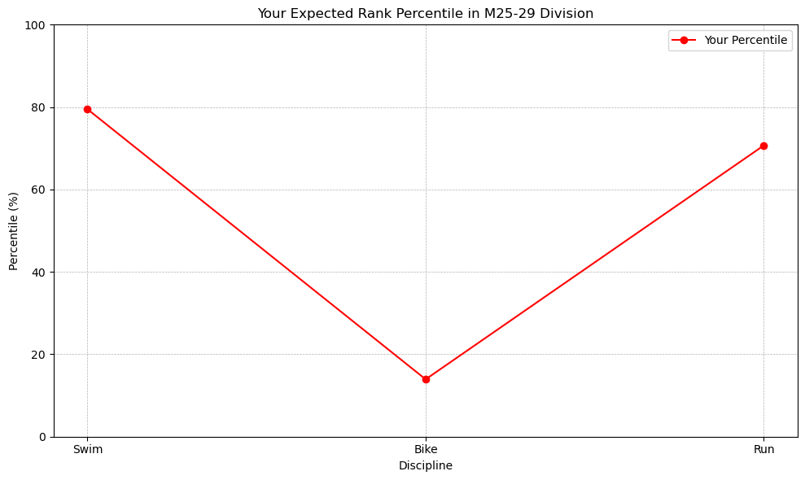
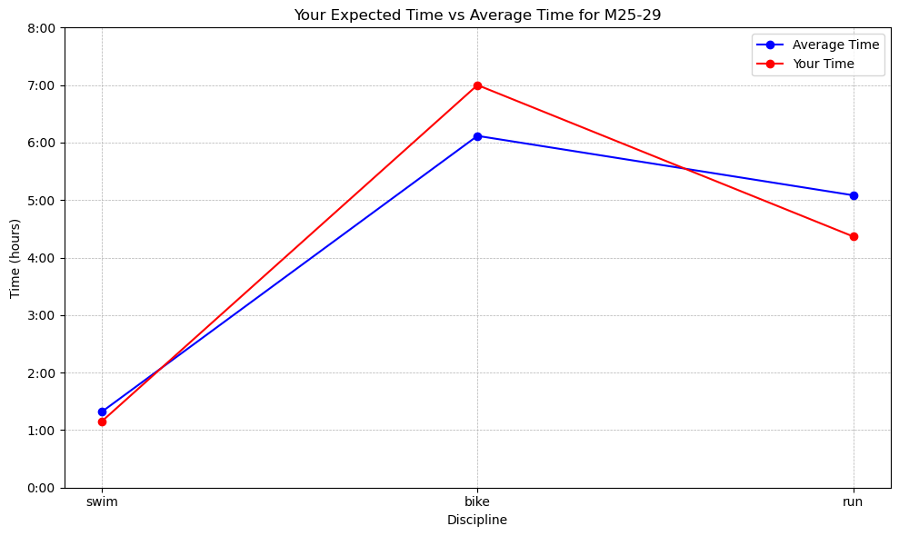

# Performance Analysis of Ironman Athletes

### In this document, we'll walk through the analysis of the performance of Ironman participants at IMMD over the past 3 years and see how you stack up based on your projected times


#### Required Imports


```python
import pandas as pd
import matplotlib.pyplot as plt
import seaborn as sns
import numpy as np
from scipy.stats import gaussian_kde
```

## This dataframe was downloaded via coachcox.co.uk


```python
df = pd.read_csv('IMMD - Sheet1.csv')
```


```python
df.head()
```


<div>
<style scoped>
    .dataframe tbody tr th:only-of-type {
        vertical-align: middle;
    }

    .dataframe tbody tr th {
        vertical-align: top;
    }

    .dataframe thead th {
        text-align: right;
    }
</style>
<table border="1" class="dataframe">
  <thead>
    <tr style="text-align: right;">
      <th></th>
      <th>Bib</th>
      <th>Name</th>
      <th>Country</th>
      <th>Gender</th>
      <th>Division</th>
      <th>Division Rank</th>
      <th>Overall Time</th>
      <th>Overall Rank</th>
      <th>Swim Time</th>
      <th>Swim Rank</th>
      <th>Bike Time</th>
      <th>Bike Rank</th>
      <th>Run Time</th>
      <th>Run Rank</th>
      <th>Finish Status</th>
      <th>Year</th>
    </tr>
  </thead>
  <tbody>
    <tr>
      <th>0</th>
      <td>446</td>
      <td>Eric Roy</td>
      <td>Canada</td>
      <td>Male</td>
      <td>M45-49</td>
      <td>1.0</td>
      <td>9:04:44</td>
      <td>1.0</td>
      <td>57:19:00</td>
      <td>23.0</td>
      <td>4:38:03</td>
      <td>3.0</td>
      <td>3:18:39</td>
      <td>6.0</td>
      <td>Finisher</td>
      <td>2021</td>
    </tr>
    <tr>
      <th>1</th>
      <td>1173</td>
      <td>Keith Kennedy</td>
      <td>United States</td>
      <td>Male</td>
      <td>M40-44</td>
      <td>1.0</td>
      <td>9:07:23</td>
      <td>2.0</td>
      <td>1:04:53</td>
      <td>124.0</td>
      <td>4:38:12</td>
      <td>4.0</td>
      <td>3:16:51</td>
      <td>4.0</td>
      <td>Finisher</td>
      <td>2021</td>
    </tr>
    <tr>
      <th>2</th>
      <td>124</td>
      <td>Alexandre Fortin</td>
      <td>Canada</td>
      <td>Male</td>
      <td>M25-29</td>
      <td>1.0</td>
      <td>9:07:30</td>
      <td>3.0</td>
      <td>1:07:03</td>
      <td>174.0</td>
      <td>4:38:22</td>
      <td>5.0</td>
      <td>3:13:42</td>
      <td>2.0</td>
      <td>Finisher</td>
      <td>2021</td>
    </tr>
    <tr>
      <th>3</th>
      <td>1132</td>
      <td>James Crosby</td>
      <td>United States</td>
      <td>Male</td>
      <td>M18-24</td>
      <td>1.0</td>
      <td>9:10:32</td>
      <td>4.0</td>
      <td>52:12:00</td>
      <td>3.0</td>
      <td>4:50:08</td>
      <td>21.0</td>
      <td>3:20:01</td>
      <td>7.0</td>
      <td>Finisher</td>
      <td>2021</td>
    </tr>
    <tr>
      <th>4</th>
      <td>364</td>
      <td>Darren Rentch</td>
      <td>United States</td>
      <td>Male</td>
      <td>M50-54</td>
      <td>1.0</td>
      <td>9:17:45</td>
      <td>5.0</td>
      <td>1:02:25</td>
      <td>82.0</td>
      <td>4:47:16</td>
      <td>15.0</td>
      <td>3:16:16</td>
      <td>3.0</td>
      <td>Finisher</td>
      <td>2021</td>
    </tr>
  </tbody>
</table>
</div>


## Time Conversion Functions

#### convert_swim_time_to_seconds 
converts the swim time to seconds due to data abnormalities, 
#### convert_to_seconds 
converts biking and running to seconds, and 
#### seconds_to_hours 
converts the aformentioned times to hours:minutes 


```python
def convert_swim_time_to_seconds(t):
    if pd.isnull(t) or not isinstance(t, str):
        return t

    parts = list(map(int, t.split(':')))
    
    if len(parts) == 3:
        h, m, s = parts
        # If hours part (h) is greater than 3 for swim, consider it as minutes
        if h > 3:
            total_seconds = h * 60 + m * 60 + s
        else:
            total_seconds = h * 3600 + m * 60 + s
    elif len(parts) == 2:
        m, s = parts
        total_seconds = m * 60 + s
    else:  # Assuming this case doesn't exist as per data format
        s = parts[0]
        total_seconds = s
    
    return total_seconds

def convert_to_seconds(t):
    if pd.isnull(t) or not isinstance(t, str):
        return t

    parts = list(map(int, t.split(':')))
    
    if len(parts) == 3:
        h, m, s = parts
        total_seconds = h * 3600 + m * 60 + s
    elif len(parts) == 2:
        m, s = parts
        total_seconds = m * 60 + s
    else:  # In case of any other unexpected format
        raise ValueError(f"Unexpected time format: {t}")
    
    return total_seconds


def seconds_to_hours(seconds):
    hours = seconds // 3600
    minutes = (seconds % 3600) // 60
    return hours + minutes/60.0

# Plotting
disciplines = ['Swim', 'Bike', 'Run']
```

## User Requests

##### Request the user to input their expected swim, bike, and run paces


```python
# User inputs
age = int(input("Enter your age: "))
gender = input("Enter your gender (Male/Female): ").capitalize()

# Define age group ranges and their respective tags
ranges = [18, 25, 30, 35, 40, 45, 50, 55, 60, 65, 70]
tags = ["18-24", "25-29", "30-34", "35-39", "40-44", "45-49", "50-54", "55-59", "60-64", "65-69", "70+"]

# Find user's age group
user_age_group = next((f"{gender[0]}{tags[i]}" for i, r in enumerate(ranges) if r <= age and (i == len(ranges) - 1 or age < ranges[i+1])), None)

print(f"You are in the {user_age_group} category.")
```

    Enter your age: 25
    Enter your gender (Male/Female): Male
    You are in the M25-29 category.


```python
# User performance based on input paces
swim_pace = float(input("Enter your expected swim pace (seconds per 100 meters): "))
user_swim_time = swim_pace * (3800/100)
bike_pace = float(input("Enter your expected bike pace (mph): "))
user_bike_time = (112/bike_pace) * 3600
run_pace = convert_to_seconds(input("Enter your expected run pace (minutes:seconds per mile): "))
user_run_time = run_pace * 26.2
```

    Enter your expected swim pace (seconds per 100 meters): 110
    Enter your expected bike pace (mph): 16
    Enter your expected run pace (minutes:seconds per mile): 10:00


#### Conversion to update to seconds


```python
df['Swim Time'] = df['Swim Time'].apply(convert_swim_time_to_seconds)
df['Bike Time'] = df['Bike Time'].apply(convert_to_seconds)
df['Run Time'] = df['Run Time'].apply(convert_to_seconds)
```

### Set variables and determine competitior averages to analysis later


```python
# Filter rows with NaN values and age group
age_group_df = df[df['Division'] == user_age_group].dropna(subset=['Swim Time', 'Bike Time', 'Run Time'])

# Calculating averages
avg_swim_time = age_group_df['Swim Time'].apply(convert_to_seconds).mean()
avg_bike_time = age_group_df['Bike Time'].apply(convert_to_seconds).mean()
avg_run_time = age_group_df['Run Time'].apply(convert_to_seconds).mean()

# Assuming avg_times_seconds and user_times_seconds are lists of times in seconds for Swim, Bike, and Run
avg_times_seconds = age_group_df[['Swim Time', 'Bike Time', 'Run Time']].mean().apply(convert_to_seconds)
user_times_seconds = [user_swim_time, user_bike_time, user_run_time]  # As defined previously

cum_avg_times = [sum(avg_times_seconds[:i+1]) for i in range(3)]
cum_user_times = [sum(user_times_seconds[:i+1]) for i in range(3)]

# Convert to hours
cum_avg_times_hours = [seconds_to_hours(t) for t in cum_avg_times]
cum_user_times_hours = [seconds_to_hours(t) for t in cum_user_times]

# Convert times for plotting
avg_times_hours = [seconds_to_hours(t) for t in [avg_swim_time, avg_bike_time, avg_run_time]]
user_times_hours = [seconds_to_hours(t) for t in [user_swim_time, user_bike_time, user_run_time]]
```

## Plotting your expected ranking for each discipline


```python
# Define the disciplines and their respective times in the dataframe
time_cols = ['Swim Time', 'Bike Time', 'Run Time']

# Calculate your rank percentiles for each discipline
percentiles = []
for user_time, col in zip(user_times_seconds, time_cols):
    times = age_group_df[col].apply(convert_to_seconds).dropna()
    worse_than_you = sum(times > user_time)
    percentile = (worse_than_you / len(times)) * 100
    percentiles.append(percentile)

# Plotting your percentiles
plt.figure(figsize=(10, 6))
plt.plot(disciplines, percentiles, marker='o', label='Your Percentile', color='r')
plt.xlabel('Discipline')
plt.ylabel('Percentile (%)')
plt.title(f'Your Expected Rank Percentile in {user_age_group} Division')
plt.ylim(0, 100)  # The percentile values will range from 0 to 100
plt.grid(True, which='both', linestyle='--', linewidth=0.5)
plt.legend()
plt.tight_layout()
plt.show()
```


    

    


## Describing how your race will go


```python
participants_2023 = int(len(age_group_df)/3)
historical_participants = len(age_group_df)

# Calculate competitors you beat and those who pass you for each discipline, normalized
beats_normalized = []
passes_normalized = []

# For Swim
swim_times = age_group_df['Swim Time'].apply(convert_to_seconds).dropna()
beat_swim = sum(swim_times > user_swim_time)
beats_normalized.append(int((beat_swim/historical_participants) * participants_2023))

# For Bike
bike_times = age_group_df['Bike Time'].apply(convert_to_seconds).dropna()
beat_bike = sum(bike_times > user_bike_time)
passed_bike = sum(bike_times < user_bike_time)  
beats_normalized.append(int((beat_bike/historical_participants) * participants_2023))
passes_normalized.append(int((passed_bike/historical_participants) * participants_2023))

# For Run
run_times = age_group_df['Run Time'].apply(convert_to_seconds).dropna()
beat_run = sum(run_times > user_run_time)  
passed_run = sum(run_times < user_run_time)  
beats_normalized.append(int((beat_run/historical_participants) * participants_2023))
passes_normalized.append(int((passed_run/historical_participants) * participants_2023))

# Get cumulative times for each participant
cumulative_times = age_group_df[['Swim Time', 'Bike Time', 'Run Time']].apply(lambda row: sum(row.apply(convert_to_seconds)), axis=1)
user_cumulative_time = sum(user_times_seconds)

# Calculate the number of participants you would beat based on cumulative time
beat_cumulative = sum(cumulative_times > user_cumulative_time)

# Normalize this number for the 2023 race
estimated_beat_2023 = int((beat_cumulative/historical_participants) * participants_2023)
estimated_position = participants_2023 - estimated_beat_2023

# Print the statements
disciplines = ['swim', 'bike', 'run']
for i, discipline in enumerate(disciplines):
    beats_percentage = (beats_normalized[i]/participants_2023) * 100
    if beats_normalized[i] > 0:
        print(f"In the 2023 race, on the {discipline}, you will pass an estimated {beats_normalized[i]} competitors ({beats_percentage:.2f}%).")
    elif beats_normalized[i] < 0:
        print(f"In the 2023 race, on the {discipline}, an estimated {abs(beats_normalized[i])} competitors ({beats_percentage:.2f}%) will pass you.")
    else:
        print(f"In the 2023 race, on the {discipline}, you will have a similar performance to your age group competitors.")
    
    if i < 2:  # For swim and bike only
        passes_percentage = (passes_normalized[i]/participants_2023) * 100
        if passes_normalized[i] > 0:
            print(f"In the 2023 race, after the {discipline}, an estimated {passes_normalized[i]} competitors ({passes_percentage:.2f}%) will pass you.")
            

print(f"In the 2023 race, you would finish approximately in position {estimated_position} out of {participants_2023} age-group participants.")

```

    In the 2023 race, on the swim, you will pass an estimated 72 competitors (79.12%).
    In the 2023 race, after the swim, an estimated 78 competitors (85.71%) will pass you.
    In the 2023 race, on the bike, you will pass an estimated 12 competitors (13.19%).
    In the 2023 race, after the bike, an estimated 26 competitors (28.57%) will pass you.
    In the 2023 race, on the run, you will pass an estimated 64 competitors (70.33%).
    In the 2023 race, you would finish approximately in position 47 out of 91 age-group participants.


## Plotting your times vs the average for your age group


```python
plt.figure(figsize=(10,6))
plt.plot(disciplines, avg_times_hours, marker='o', label='Average Time', color='b')
plt.plot(disciplines, user_times_hours, marker='o', label='Your Time', color='r')

plt.xlabel('Discipline')
plt.ylabel('Time (hours)')
plt.title(f'Your Expected Time vs Average Time for {user_age_group}')

# Adjust y-axis labels to display in the "hours:minutes" format
labels = [f"{int(t)}:{int((t*60)%60):02}" for t in plt.yticks()[0]]
plt.yticks(plt.yticks()[0], labels)

plt.legend()
plt.grid(True, which='both', linestyle='--', linewidth=0.5)
plt.tight_layout()
plt.show()

```


    

    


### Distribution of times across the age group


```python
plt.figure(figsize=(12, 6))
sns.boxplot(data=age_group_df, x="Division", y=age_group_df['Swim Time'].apply(lambda x: seconds_to_hours(convert_to_seconds(x))))
plt.title("Distribution of Swim Times 2019-2022")
plt.ylabel("Hours")
plt.show()
```


    

    


```python
plt.figure(figsize=(12, 6))
sns.boxplot(data=age_group_df, x="Division", y=age_group_df['Bike Time'].apply(lambda x: seconds_to_hours(convert_to_seconds(x))))
plt.title("Distribution of Bike Times 2019-2022")
plt.ylabel("Hours")
plt.show()
```


    

    


```python
plt.figure(figsize=(12, 6))
sns.boxplot(data=age_group_df, x="Division", y=age_group_df['Run Time'].apply(lambda x: seconds_to_hours(convert_to_seconds(x))))
plt.title("Distribution of Run Times 2019-2022")
plt.ylabel("Hours")
plt.show()
```


    

    


## Bar plotting those distributions


```python
# Convert Swim Times to hours
swim_times_hours = age_group_df['Swim Time'].apply(lambda x: seconds_to_hours(convert_to_seconds(x)))

# Compute the KDE for Swim Times
density = gaussian_kde(swim_times_hours)
x_vals = np.linspace(min(swim_times_hours), max(swim_times_hours), 1000)
y_vals = density(x_vals)

# Adjust the KDE to match the histogram's area
bin_width = (max(swim_times_hours) - min(swim_times_hours)) / 30  # 30 bins
hist_area = len(swim_times_hours) * bin_width
kde_area = np.trapz(y_vals, x=x_vals)
y_vals *= hist_area / kde_area

plt.figure(figsize=(12, 6))

# Plot the histogram
sns.histplot(swim_times_hours, bins=30, kde=False, label='Other Athletes')

# Plot the KDE
plt.plot(x_vals, y_vals, label='KDE Trend', color='blue')

# Plot your expected swim time
your_swim_time_hours = seconds_to_hours(user_swim_time)
plt.scatter(your_swim_time_hours, density(your_swim_time_hours) * hist_area / kde_area, color='red', s=100, zorder=5, label='Your Expected Time')

plt.title("Distribution of Swim Times 2019-2022")
plt.xlabel("Hours")
plt.legend()
plt.show()

```


    

    


```python
# Convert Swim Times to hours
bike_times_hours = age_group_df['Bike Time'].apply(lambda x: seconds_to_hours(convert_to_seconds(x)))

# Compute the KDE for Swim Times
density = gaussian_kde(bike_times_hours)
x_vals = np.linspace(min(bike_times_hours), max(bike_times_hours), 1000)
y_vals = density(x_vals)

# Adjust the KDE to match the histogram's area
bin_width = (max(bike_times_hours) - min(bike_times_hours)) / 30  # 30 bins
hist_area = len(bike_times_hours) * bin_width
kde_area = np.trapz(y_vals, x=x_vals)
y_vals *= hist_area / kde_area

plt.figure(figsize=(12, 6))

# Plot the histogram
sns.histplot(bike_times_hours, bins=30, kde=False, label='Other Athletes')

# Plot the KDE
plt.plot(x_vals, y_vals, label='KDE Trend', color='blue')

# Plot your expected swim time
your_bike_times_hours = seconds_to_hours(user_bike_time)
plt.scatter(your_bike_times_hours, density(your_bike_times_hours) * hist_area / kde_area, color='red', s=100, zorder=5, label='Your Expected Time')

plt.title("Distribution of Bike Times 2019-2022")
plt.xlabel("Hours")
plt.legend()
plt.show()

```


    

    


```python
# Convert Swim Times to hours
run_times_hours = age_group_df['Run Time'].apply(lambda x: seconds_to_hours(convert_to_seconds(x)))

# Compute the KDE for Swim Times
density = gaussian_kde(run_times_hours)
x_vals = np.linspace(min(run_times_hours), max(run_times_hours), 1000)
y_vals = density(x_vals)

# Adjust the KDE to match the histogram's area
bin_width = (max(run_times_hours) - min(run_times_hours)) / 30  # 30 bins
hist_area = len(run_times_hours) * bin_width
kde_area = np.trapz(y_vals, x=x_vals)
y_vals *= hist_area / kde_area

plt.figure(figsize=(12, 6))

# Plot the histogram
sns.histplot(run_times_hours, bins=30, kde=False, label='Other Athletes')

# Plot the KDE
plt.plot(x_vals, y_vals, label='KDE Trend', color='blue')

# Plot your expected swim time
your_run_times_hours = seconds_to_hours(user_run_time)
plt.scatter(your_run_times_hours, density(your_run_times_hours) * hist_area / kde_area, color='red', s=100, zorder=5, label='Your Expected Time')

plt.title("Distribution of Run Times 2019-2022")
plt.xlabel("Hours")
plt.legend()
plt.show()

```


    

    


## Finding your cumulative time comparison


```python
plt.figure(figsize=(12, 6))
plt.fill_between(disciplines, cum_avg_times_hours, color="blue", alpha=0.4, label="Average Time")
plt.fill_between(disciplines, cum_user_times_hours, color="red", alpha=0.4, label="Your Expected Time")
plt.title("Cumulative Expected Time by Discipline")
plt.ylabel("Hours")
plt.legend(loc="upper left")
plt.show()
```


    

    


```python
labels = disciplines
avg_vals = avg_times_hours  
user_vals = user_times_hours  

angles = np.linspace(0, 2 * np.pi, len(labels), endpoint=False).tolist()

# Make the plot circular
avg_vals += avg_vals[:1]
user_vals += user_vals[:1]
labels += labels[:1]
angles += angles[:1]

fig, ax = plt.subplots(figsize=(12, 6), subplot_kw=dict(polar=True))
ax.plot(angles, avg_vals, color='blue', label='Average Time')
ax.fill(angles, avg_vals, color='blue', alpha=0.25)
ax.plot(angles, user_vals, color='red', label='Your Expected Time')
ax.fill(angles, user_vals, color='red', alpha=0.25)
ax.set_yticklabels([])
ax.set_xticks(angles)
ax.set_xticklabels(labels)
ax.set_title("Comparison of Your Expected Time vs. Average Time IMMD 2019-2023", va='bottom')
ax.legend(loc='lower right', bbox_to_anchor=(1.15, 1.15))
plt.show()

```


    

    

